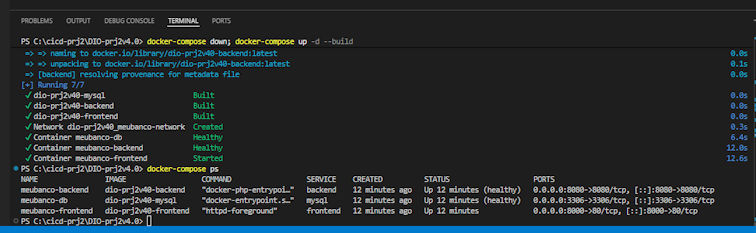
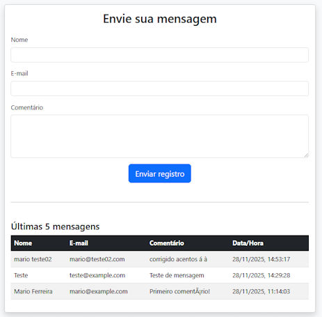

# 📱 Projeto de Mensagens - Frontend + Backend + Database

# Objetivo: criação de uma pipeline de deploy com GitLab e Kubernetes 

### Referência utilizada: do Prof. Denilson Bonatti (https://gitlab.com/denilsonbonatti/kubernetes-projeto2-dio)


## Ambiente de desenvolvimento:

<p>
Windows 11 / WSL2 - Ubuntu com Docker Desktop V 4.51.0,IDE: Visual Studio Code + Copilot Pro; Terminal, Power Shell V.7.5.4, notepad++, GitHub Desktop. GitKraken, GitLab. Com o VS code, no copilot foram utilizadas as AIs: GPT-5 mini, Grok Code Fast 1,  Claude Haiku 4.5.
</p>

        - Criado o cluster no GCP com um VM Bastion.
        - Criada a pipeline no GitLab com todas as variáveis protegidas.
        - Instalado o GitKraken para controlar e fazer a atualização em real-time no GitLab durante a edição no VS Code.

<p>
Optei por utilizar a minha aplicação do primeiro projeto de kubernetes o que causou vários problemas com os deployments e, por consequencia, na pipeline. O que depois do terceiro dia, verifiquei a conta do Google ultrapassando 50 reais, o que tornou inviável a continuação do teste, tendo que deletar o cluster e a VM Bastion.
</p>

<p>
Continuando o projeto localmente, foi utilizado um docker-compose para fazer teste da aplicação localmente. Nas figuras abaixo encontram-se o build e deploy e mais a frontpage do projeto.
<p>

<div align="center">
<p float="left">
 
</p>
</div>

<div align="center">
<p float="left">
 
</p>
</div>

Links para repositórios do projeto:

GitLab:
https://gitlab.com/marioTavFer/DIO-prj2v4.0

GitHub:
https://github.com/marioTavFer/DIO-prj2v4.0

Imagens no Docker Hub:
https://hub.docker.com/repositories/marioltf


## Abaixo está a documentação do Projeto com a ajuda do copilot - Claude Haiku 4.5


## 🎯 Visão Geral

Sistema web simples para envio e listagem de mensagens, deployado em Kubernetes (GCP) com:

- **Frontend**: Apache HTTPd servindo HTML estático + JavaScript
- **Backend**: PHP 8.2 com Apache, expõe endpoints para CRUD de mensagens
- **Database**: MySQL 8.0 com persistência em GCP
- **CI/CD**: GitLab CI/CD com build automático e deploy em GKE
- **Segurança**: Bastion VM para acesso ao cluster

## 📂 Estrutura

```
.
├── frontend/               # Frontend estático (HTML + JS)
├── backend/                # Backend PHP (endpoints REST)
├── database/               # Scripts MySQL + Dockerfile
├── kubernetes/             # Manifests K8s (3 separados)
├── .gitlab-ci.yml          # Pipeline CI/CD GitLab
├── Dockerfile.frontend     # Build frontend
├── Dockerfile.backend      # Build backend
├── docker-compose.yml      # Testes locais
└── README.md               # Este arquivo
```

## 🚀 Quick Start

### Local (Docker Compose)
```bash
docker-compose up -d
# Frontend: http://localhost:8000
# Backend: http://localhost:8080
```

### GCP Kubernetes
1. Seguir **SETUP_CHECKLIST.md** para configurar CI/CD variables
2. Fazer commit e push para `main`
3. GitLab CI/CD executa pipeline automaticamente
4. Deploy em Kubernetes em ~5-10 minutos


## ✅ Arquitetura de teste local (dock-compose)

```
                        [Internet]
                            |
                    [LoadBalancer - GCP]
                            |
            ┌───────────────┴───────────────┐
            |                               |
    [Frontend Pod]                   [Backend Pod]
    (Apache 80)                      (PHP 8080)
            |                               |
            └───────────────┬───────────────┘
                            |
                      [MySQL Pod]
                    (MySQL 3306)
                   + PVC Storage
```

### ✅ Arquitetura para GCP - Cluster com VM Bastion

```
                        [Internet]
                            |
                  ┌─────────┴─────────┐
                  |                   |
              [SSH Tunnel]     [LoadBalancer]
            via Bastion        port: 80
              (6443)                 |
                  |        ┌────────────────┐
                  |        |                |
            ┌─────┴──────┐ |                |
            | via tunnel | | frontend-service
            |            | |                |
        [GCP Network]     ▼ ▼               ▼
                    ┌──────────┐       ┌───────────────┐
                    │ Frontend │       │ Frontend Svc  │
                    │   Pod    │       │  LoadBalancer │
                    │ (80)     │       │   :80→:80     │
                    │ 2 replicas
                    └─────┬────┘       └───────────────┘
                          |
                          | (localhost em dev)
                          | (backend-service em prod)
                          |
                    ┌─────▼────┐       ┌───────────────┐
                    │ Backend  │       │ Backend Svc   │
                    │   Pod    │       │ ClusterIP     │
                    │ (8080)   │       │  :8080→:8080  │
                    │ 2 replicas
                    └─────┬────┘       └───────────────┘
                          |
                    ┌─────▼────┐       ┌───────────────┐
                    │  MySQL   │       │ MySQL Svc     │
                    │   Pod    │       │ Headless      │
                    │ (3306)   │       │ :3306→:3306   │
                    │ 1 replica│       │               │
                    │ + PVC    │       │               │
                    └──────────┘       └───────────────┘
```

**Características**:
1. ✅ 3 Pods SEPARADOS (frontend, backend, mysql)
2. ✅ 3 Services ESPECÍFICOS
3. ✅ Frontend usa DNS do Service (`backend-service`)
4. ✅ Health checks implementados
5. ✅ Resource limits configurados
6. ✅ Security context aplicado
7. ✅ Rolling updates sem downtime
8. ✅ Bastion SSH para acesso seguro

## 🔐 Segurança

- Credenciais via **Protected CI Variables** (masked)
- Secrets criados dinamicamente em cada deploy
- SecurityContext: containers como usuários não-root
- RBAC habilitado, Service Accounts dedicadas
- Health checks e resource limits configurados

## 📝 Variáveis de Ambiente Necessárias

Configure no GitLab CI/CD:

```
DOCKERHUB_USERNAME          # Usuário Docker Hub
DOCKERHUB_TOKEN             # Token Docker Hub (Personal Access Token)
DOCKERHUB_REPO_PREFIX       # Prefixo repo (ex: seu-usuario)
GOOGLE_SERVICE_ACCOUNT_KEY  # Service account GCP (base64)
GCP_PROJECT_ID              # ID do projeto GCP
GKE_CLUSTER_NAME            # Nome cluster GKE
GKE_ZONE                    # Zona (ex: us-central1-a)
DB_USER                     # Usuário MySQL (Protected)
DB_PASSWORD                 # Senha MySQL (Protected)
DB_ROOT_PASSWORD            # Senha root MySQL (Protected)
BASTION_USER                # Usuário Bastion SSH (opcional)
BASTION_HOST                # IP/DNS Bastion (opcional)
BASTION_KEY                 # Chave SSH Bastion (base64, opcional)
KUBERNETES_API              # IP interno Kubernetes API (opcional)
```

## 🧪 Testes

### Local
```bash
docker-compose up -d
curl http://localhost:8000          # Frontend
curl http://localhost:8080/index.php # Backend (POST)
curl http://localhost:8080/get_messages.php # Backend (GET)
```

### Kubernetes
```bash
kubectl get deployments
kubectl get services
kubectl get pods
kubectl logs -f deployment/frontend-deployment
```

## 📊 Pipeline CI/CD

1. **Build** (on push to main)
   - Build imagens Docker para frontend, backend, MySQL
   - Push para Docker Hub com tag de commit

2. **Deploy** (após build bem-sucedido)
   - Autenticar no GCP + Bastion
   - Criar/atualizar Secrets
   - Aplicar manifests Kubernetes
   - Aguardar rollout dos deployments

## 🛠️ Tech Stack

- **Frontend**: Apache HTTPd 2.4 Alpine + HTML5 + Bootstrap + Vanilla JS
- **Backend**: PHP 8.2 + Apache + PDO MySQL
- **Database**: MySQL 8.0
- **Container**: Docker
- **Orquestração**: Kubernetes (GCP GKE)
- **CI/CD**: GitLab CI
- **Acesso**: Bastion VM SSH

## 📞 Referências

- [Kubernetes Docs](https://kubernetes.io/)
- [GitLab CI/CD](https://docs.gitlab.com/ee/ci/)
- [GCP GKE](https://cloud.google.com/kubernetes-engine/docs)

---

**Última atualização**: 28 de Novembro de 2025  
**Versão**: 1.0 ✅ Corrigido
